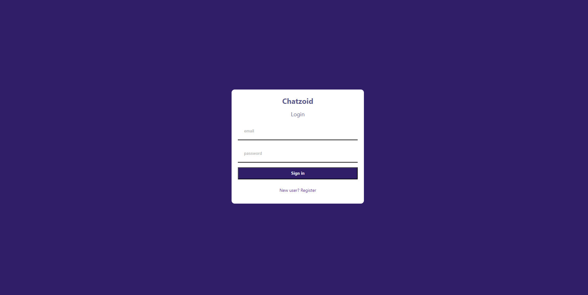
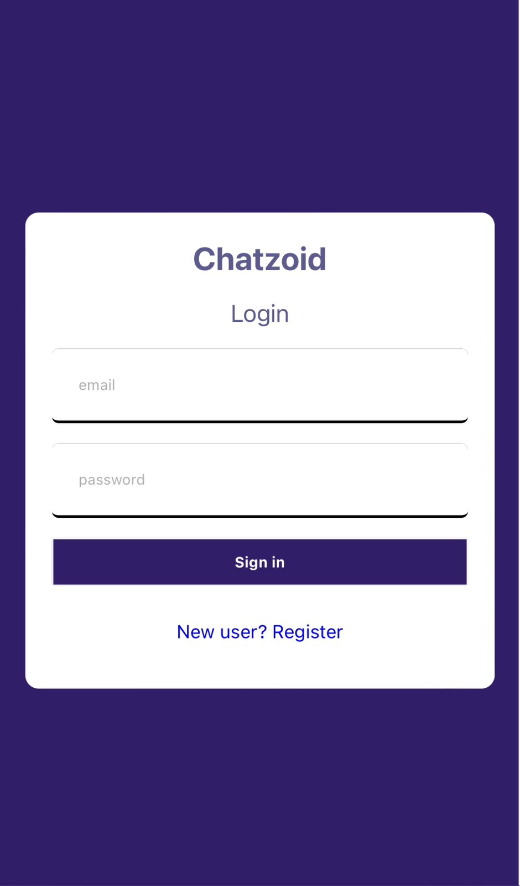
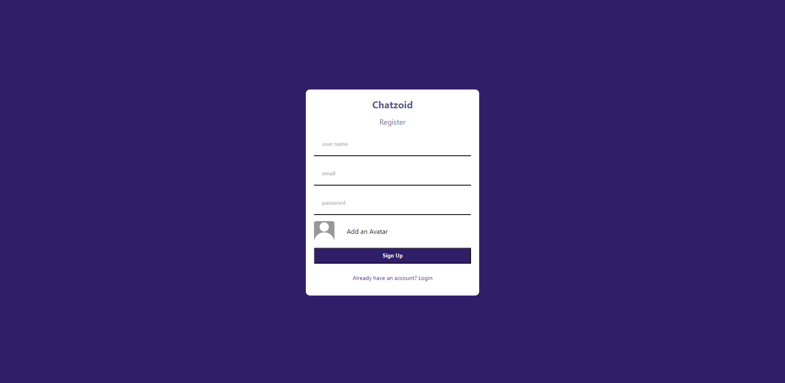
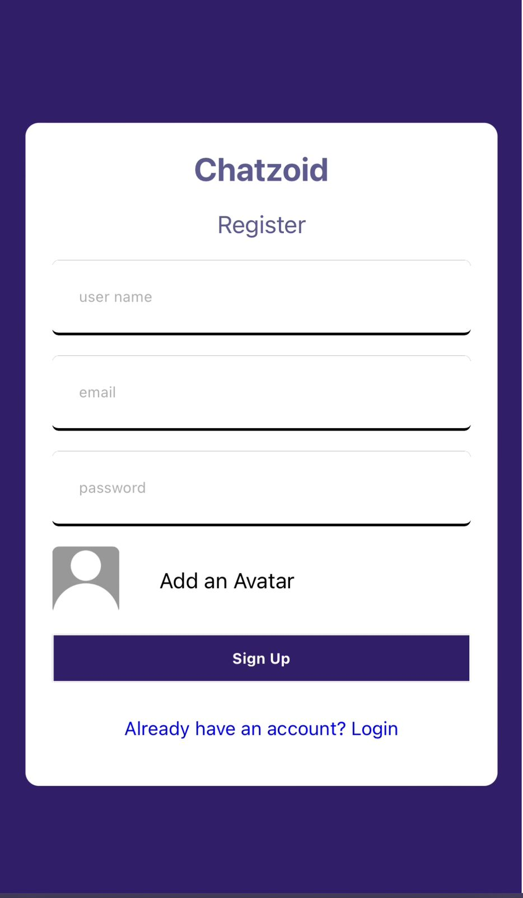
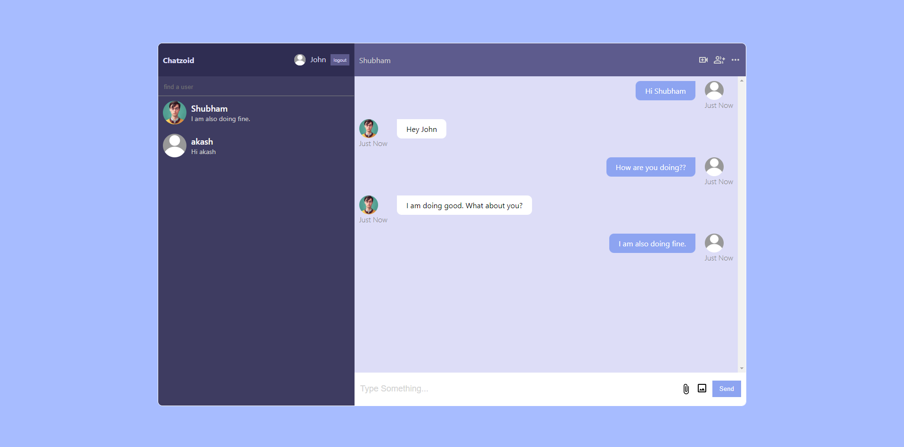

Chatzoid is a real-time messaging platform built with React.js, SCSS, and Firebase database. With its user-friendly interface and sleek design, Chatzoid allows users to instantly connect with each other, share messages and media,

<h1>Login Page</h1>

<h1>Register Page</h1>

<h1>Home Page</h1>

